# Sistema de Gestión de Estudiantes con Árboles Binarios de Búsqueda

## 📋 Descripción del Proyecto

Este proyecto implementa un sistema académico para la gestión de estudiantes utilizando **Árboles Binarios de Búsqueda (ABB)** en lenguaje C++. El sistema permite administrar información de estudiantes como cédula, apellidos, nombres, nota final, carrera y nivel, organizándolos automáticamente por cédula para facilitar búsquedas, inserciones y eliminaciones eficientes.

### Características Principales

- **Organización automática**: Los estudiantes se ordenan por cédula en el árbol binario
- **Operaciones eficientes**: Inserción, búsqueda y eliminación con complejidad O(log n) promedio
- **Múltiples recorridos**: Inorden, Preorden, Postorden y BFS (por niveles)
- **Estadísticas académicas**: Cálculo de altura, conteo de nodos, mejor/menor nota
- **Clasificación automática**: Separación de estudiantes aprobados y reprobados
- **Interfaz por consola**: Menú interactivo intuitivo

## 🏗️ Estructura del Proyecto (Orientado a Objetos)
proyecto/
├── Estudiante.h # Definición de la clase Estudiante
├── Estudiante.cpp # Implementación de métodos de Estudiante
├── Nodo.h # Definición de la clase Nodo (template)
├── Nodo.cpp # Implementación de la clase Nodo
├── ArbolBinario.h # Definición de la clase ArbolBinario
├── ArbolBinario.cpp # Implementación del árbol binario
├── main.cpp # Programa principal y menú interactivo
└── README.md # Documentación del proyecto

## 📊 Capturas de Ejecución

### Menú Principal del Sistema

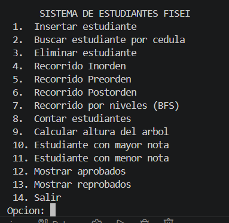
*Interfaz principal con las 14 opciones disponibles*

### Inserción de Estudiantes

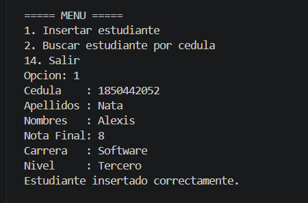
*Registro de un nuevo estudiante con todos sus datos académicos*

### Búsqueda de Estudiante por Cédula

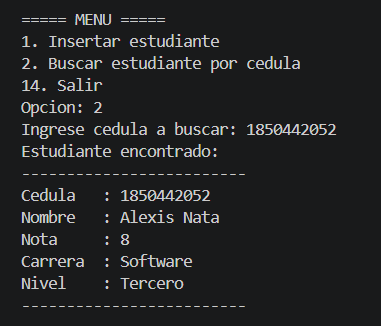
*Búsqueda eficiente usando el árbol binario de búsqueda*

### Eliminación de Estudiante

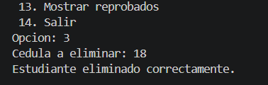
*Eliminación de un estudiante manteniendo la estructura del árbol*

### Recorrido Inorden (Ordenado por Cédula)

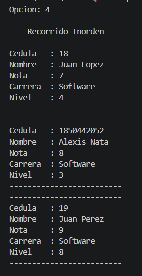
*Muestra los estudiantes ordenados ascendentemente por cédula*

### Recorrido Preorden

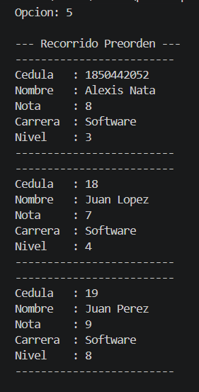
*Visita raíz → izquierda → derecha*

### Recorrido Postorden

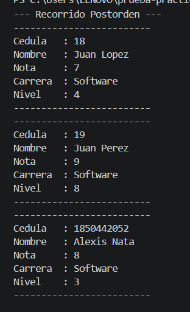
*Visita izquierda → derecha → raíz*

### Recorrido por Niveles (BFS)

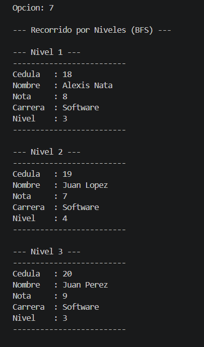
*Recorrido por niveles usando una cola*

### Conteo de Estudiantes

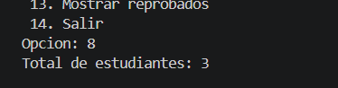
*Muestra el total de estudiantes registrados*

### Cálculo de Altura del Árbol

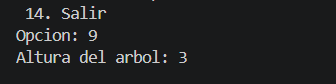
*Altura máxima desde la raíz hasta la hoja más profunda*

### Mejor y Peor Nota

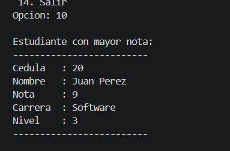
*Estudiante con la calificación más alta*

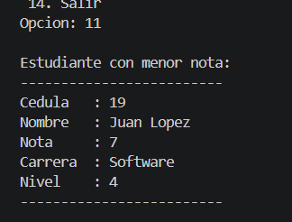
*Estudiante con la calificación más baja*

### Estudiantes Aprobados y Reprobados

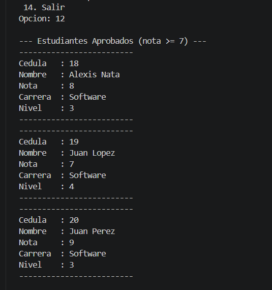
*Lista de estudiantes con nota ≥ 7*

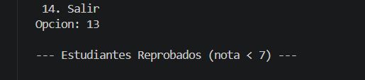
*Lista de estudiantes con nota < 7*

## 🛠️ Requisitos del Sistema

### Para compilar y ejecutar:

- **Compilador**: GCC (MinGW para Windows, g++ para Linux/Mac)
- **Versión C++**: C++11 o superior
- **Sistema Operativo**: Windows, Linux o macOS

## 📥 Instrucciones de Compilación y Ejecución

### Opción 1: Compilación con archivos separados (Recomendado)

# Enlazar todos los objetos
g++ Estudiante.o Nodo.o ArbolBinario.o main.o -o sistema_estudiantes.exe

# Ejecutar
./sistema_estudiantes.exe